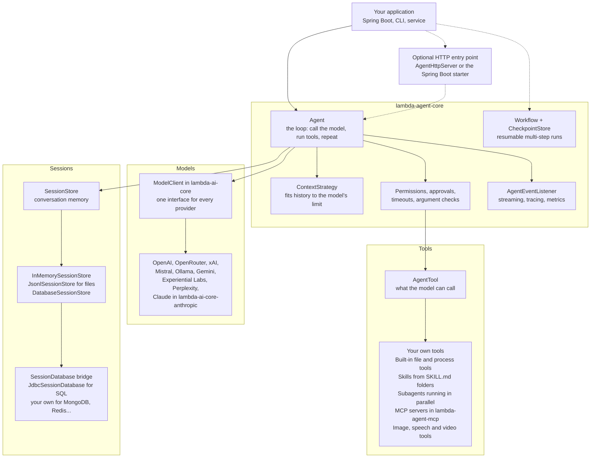
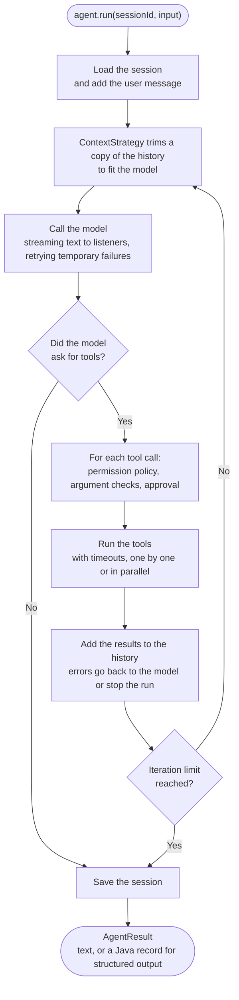

<div align="center">

# Lambda AI Agent Framework 🤖
**A Lightweight, Embeddable Java Framework for Building LLM-Powered Agents**

[](https://openjdk.org/)
[](https://maven.apache.org/)
[](https://opensource.org/licenses/MIT)
[]()

Lambda AI is a minimal, modular Java library designed to bring autonomous AI agent capabilities to your Java backend, Spring Boot applications, or CLI tools. 

[Quick Start](#-quick-start) • [Architecture](#-architecture) • [Key Features](#-key-features) • [How it Works](#-what-is-lambda-ai) • [Documentation](docs/SystemInfo.md)

</div>

---

## 🚀 What is Lambda AI?
Lambda AI provides the essential building blocks to create conversational AI agents that can **think, remember, and act**. Unlike heavy, monolithic frameworks, Lambda AI acts as a clean, embeddable library. It handles the complex LLM communication loop so you can focus on building custom tools and business logic.

If you want to build an AI assistant in Java that can read local files, call your company's internal APIs, or interact with databases autonomously, Lambda AI is the framework you need.

## 🧱 Architecture

Lambda AI is a set of small modules. Your application talks to an `Agent`; everything the agent
uses sits behind an interface you can swap or implement yourself.



One call to `agent.run(sessionId, input)` goes through this loop:



The run timeout and the `CancellationToken` are checked before every model call; either one
stops the run with an exception.

More detail, including the workflow engine and observability, is in the
[System Architecture Documentation](docs/SystemInfo.md).

## ✨ Key Features

- **🔌 Nine LLM Providers:** OpenAI, Claude, Gemini, OpenRouter, xAI, Mistral, Perplexity, Experiential Labs and Ollama behind one `ModelClient` interface, with normalized usage/finish metadata and streaming tool calls.
- **🖼️ Images, Audio, Video and PDFs:** Send media to models that accept it (each client declares what its model takes and rejects the rest with a clear message), and generate images, speech and video, or transcribe audio, directly or as agent tools.
- **🛠️ Autonomous Tool Calling:** Define tools using standard Java interfaces. The agent automatically decides when to call them and maps JSON arguments to your Java methods.
- **🧠 Persistent Memory:** Keep sessions in files (`JsonlSessionStore`) or in your own database, SQL through any JDBC `DataSource` or NoSQL through a two-method bridge (`DatabaseSessionStore`), with JDBC and Redis checkpoint stores for durable, versioned workflow state.
- **⚡ Event-Driven Architecture:** Use `AgentEventListener` to hook into the agent's thought process, allowing for real-time UI streaming and execution monitoring.
- **🛡️ Built for Production:** Robust error-handling strategies (`SEND_TO_MODEL` vs `THROW`) ensure your agent can self-heal when a tool fails.
- **📈 Runtime Controls:** Run IDs, cancellation tokens, deadlines, token-usage metadata, lifecycle events, and tool argument limits support production operation.
- **🏎️ Fast by Default:** Shared HTTP/2 connections across clients, cached token counts, media encoded once, Claude prompt caching, and read-only tools that run in parallel while writes run one by one (see [Production Operations](docs/ProductionOperations.md#performance)).
- **🔁 Bounded Model Retries:** Configure finite retries with exponential backoff for transient provider failures.
- **⏯️ Resumable Workflows:** Compose explicit steps with checkpoint persistence and resume failed executions without repeating completed steps.
- **🗄️ JDBC Checkpoints:** Persist versioned workflow checkpoints through any `DataSource`, including Postgres, without bundling a JDBC driver.
- **⚡ Redis Checkpoints:** Use the `RedisCheckpointClient` SPI with Lettuce, Jedis, or another Redis client for atomic compare-and-set persistence.
- **🔎 Structured Tracing:** Capture run, model, retry, iteration, and tool events through a pluggable tracer.
- **🛡️ Tool Safety:** Tools can require approval and enforce execution timeouts.
- **🌿 Reliable Workflow Fan-out:** Main workflows support parallel branches with branch-local retries, cancellation propagation, persisted branch state, joins, and resumable approval steps.
- **📊 Observability:** Trace IDs propagate through agent runs and workflows, with pluggable span exporters, OTLP/HTTP export hooks, and metric recording.
- **🚀 Deployment Integrations:** The JDK HTTP bridge supports authenticated, bounded agent/workflow requests and SSE result responses; the optional Spring Boot starter provides configuration and dependency-injected REST exposure.
- **📦 Release Readiness:** Public extension contracts, compatibility guidance, production examples, security policy, CI quality gates, dependency checks, and manual version/tag release automation are included.
- **📡 Provider Streaming:** OpenAI and Gemini adapters expose incremental text and normalized tool-call responses.
- **🔐 Argument and File Safety:** Tools can validate arguments, cap result size, and restrict file reads to a configured root.
- **🧾 Structured Output:** Get answers as Java records: the schema is generated from the record, and answers with missing fields, wrong types or failed checks are sent back to the model to fix.
- **🔌 MCP Servers:** The optional `lambda-agent-mcp` module connects to any MCP server (stdio or Streamable HTTP) with the official MCP Java SDK; its tools get capabilities from the server's hints, so permissions and approvals apply.
- **🌐 Integration Boundaries:** Optional JDK HTTP serving, MCP, and trace-export hooks are available without forcing integration dependencies into the core.
- **📚 Agent Skills:** Load `SKILL.md` instruction folders; the agent sees short descriptions up front and loads full instructions and files only when a task needs them.
- **🤝 Subagents:** Break work into tasks that run in parallel in specialist subagents or self-clones, with clean contexts, inherited safety settings, and depth, parallelism and task limits.
- **🛂 Tool Governance:** Typed input parsing, composable permission decisions, audit events, and bounded file, process, and network tools protect execution paths.

## 💻 Quick Start

### 1. Requirements
* Java 25 or higher
* Maven 3.8+
* An API key for a supported provider (the quick-start example uses Google Gemini; see
  [Providers and Media](#-providers-and-media) for the others, or run Ollama locally without a key)

### 2. Set Your API Key
Export your Gemini API key to your environment variables:

```bash
export GEMINI_API_KEY="your-api-key-here"
```

### 3. Run the Example Agent
Clone this repository and run the pre-built CLI agent, which includes file-reading capabilities and persistent memory:

```bash
git clone https://github.com/Mr-XX23/LambdaAI.git
cd LambdaAI/examples/simple-chat-with-JSONL-file-based-session-storage
mvn clean compile exec:java
```

## 🧩 Building a Custom Tool is Easy

To give your agent a new superpower, just implement the `AgentTool` interface. The framework handles the rest.

```java
public class WeatherTool implements AgentTool {
    @Override
    public String getName() { return "get_weather"; }

    @Override
    public String getDescription() { return "Fetches the current weather for a specific city."; }

    @Override
    public String getJsonSchema() { 
        return "{ \"type\": \"object\", \"properties\": { \"city\": { \"type\": \"string\" } } }"; 
    }

    @Override
    public ToolResult execute(ToolInvocationContext ctx) {
        // Your Java business logic goes here
        String city = new JSONObject(ctx.getArgumentsJson()).getString("city");
        return ToolResult.of("The weather in " + city + " is sunny and 75°F.");
    }
}
```

## 📚 Teaching the Agent with Skills

A skill is a folder of instructions for one kind of task, in the same `SKILL.md`
format used by Claude and the Antigravity SDK. No Java code is needed:

```
skills/
└── release-notes/
    ├── SKILL.md        ← name, description, and step-by-step instructions
    └── template.md     ← optional extra files the instructions refer to
```

```markdown
---
name: release-notes
description: Turns merged changes into release notes. Use when asked for a changelog.
---
1. Read `template.md` with `read_skill_file` and follow its layout.
2. ...
```

```java
Skills skills = Skills.load(Path.of("skills"));
AgentConfig config = new AgentConfig(prompt, model, tools, 8).withSkills(skills);
```

Only each skill's name and description go into the system prompt. The agent loads
the full instructions with `load_skill` when a task matches, and reads extra files
with `read_skill_file`, which cannot leave the skill's folder. See
[`examples/skills-agent`](examples/skills-agent).

## 🤝 Subagents and Multi-Agent Work

An agent can break a large task into parts and hand them to **subagents** that run in
parallel. Each subagent starts with a clean slate (only the task it was given), and the
main agent gets back every subagent's final answer.

- **Specialists** have their own instructions, a subset of the main agent's tools, and
  optionally their own model. Define them in code or in Markdown files.
- **Self-cloning** lets the agent start copies of itself (`self`) for independent parts
  of a big job. Copies can delegate further, up to a depth limit.

```markdown
<!-- agents/code-reviewer.md -->
---
name: code-reviewer
description: Finds bugs in the Java files it is given. Give it exact file paths.
tools: [read_file]
model: pro            # optional: a key of the models map, or "inherit"
---
You are a careful senior Java reviewer. ...
```

```java
Subagents subagents = Subagents.load(Path.of("agents"), Map.of("pro", proModel))
        .withSelfCloning(true)     // allow copies of itself
        .withMaxParallel(4)        // subagents running at once per call
        .withMaxDepth(2);          // levels of self-clones below the main agent (max 10)

AgentConfig config = new AgentConfig(prompt, model, tools, 10).withSubagents(subagents);
```

The model calls `invoke_subagent` with a list of `{agent, task}` items; they run in
parallel and one failing does not stop the others. Subagents inherit the main agent's
permission policy, approval handler, retries, context strategy and limits, and can only
be given tools the main agent has. They are stopped if the main agent runs out of time.
Listen with `onSubagentStart`, `onSubagentEnd` (which includes the subagent's full
transcript) and `onSubagentError`. See [`examples/multi-agent`](examples/multi-agent).

## 🧾 Structured Output: Answers as Java Objects

Describe the answer as a record and get an instance back instead of text:

```java
record Line(String item, int quantity, double unitPrice) {}

@Description("An invoice found in an email")
record Invoice(@Description("Company that must pay") String customer,
               LocalDate invoiceDate, List<Line> lines, double total,
               Optional<String> paymentTerms) {}          // Optional = not required

Invoice invoice = agent.run("s1", "Extract the invoice:\n" + email,
        StructuredOutput.of(Invoice.class)
            .withValidator(i -> { if (i.total() < 0) throw new IllegalArgumentException("total must not be negative"); }))
    .value();
```

The JSON Schema is generated from the record (strings, numbers, booleans, enums, lists,
maps, nested records, `Optional`, dates, `UUID`). The model delivers its answer by calling a
`submit_result` tool, so it can still use other tools first. If the answer has missing
fields, wrong types, unknown fields, or fails a validator or the record's own constructor,
every problem is sent back with its path (like `$.lines[1].quantity`) and the model tries
again. `StructuredOutput.ofSchema(json)` takes a raw JSON Schema and returns a `Map`. See
[`examples/structured-output`](examples/structured-output).

## 🌍 Providers and Media

Choose a model with one string; the key comes from the provider's environment variable:

```java
ModelClient model = Models.create("gemini:gemini-3.1-flash");   // GEMINI_API_KEY
ModelClient other = Models.create("claude:claude-opus-5-5");     // ANTHROPIC_API_KEY
ModelClient local = Models.create("ollama:gemma3:4b");           // no key
ModelClient fromConfig = Models.create(System.getenv("LAMBDA_MODEL"));
```

Add the dependency for the providers you use; each brings everything that provider needs:

| Dependency | Providers (`Models.create` name) |
|---|---|
| `lambda-ai-core` | `openrouter`, `xai`, `mistral`, `perplexity`, `perplexity-router`, `experiential`, `ollama`, `ollama-cloud` (built-in client, no extra libraries) |
| `lambda-ai-core-openai` | `openai` / `chatgpt`, through OpenAI's official SDK |
| `lambda-ai-core-gemini` | `gemini` / `google`, through Google's official SDK |
| `lambda-ai-core-anthropic` | `anthropic` / `claude`, through Anthropic's official SDK |

Each of the last three also brings `lambda-ai-core`, so one line is enough:

```xml
<dependency>
    <groupId>ai.lambda</groupId>
    <artifactId>lambda-ai-core-gemini</artifactId>
</dependency>
```

A provider that is not installed says which dependency to add. The clients can also be created
directly:

| Provider | Client | Media it accepts | Can generate |
|---|---|---|---|
| OpenAI | `new OpenAIModelClient(key, "gpt-5")` (module `lambda-ai-core-openai`) | images, PDFs; audio on audio models | images, speech, transcription |
| Claude | `new AnthropicModelClient(key)` (module `lambda-ai-core-anthropic`) | images, PDFs, text documents | — |
| Gemini | `new GeminiModelClient(key, "gemini-3.8-flash")` (module `lambda-ai-core-gemini`) | images, audio, video, PDFs | images, speech, video (Veo) |
| OpenRouter | `OpenAICompatibleModelClient.openRouter(key, "provider/model")` | images, audio, video, PDFs (model-dependent) | images |
| xAI | `OpenAICompatibleModelClient.xai(key, "grok-4.7")` | images | images, speech, transcription, video |
| Mistral | `OpenAICompatibleModelClient.mistral(key, "mistral-medium-latest")` | images, PDFs; audio on Voxtral | speech, transcription |
| Perplexity | `ResponsesModelClient.perplexity(key, "perplexity/sonar")` | images | — |
| Experiential Labs | `OpenAICompatibleModelClient.experientialLabs(key, "qwen3.8-27b")` | images | — |
| Ollama | `OpenAICompatibleModelClient.ollama("gemma4")` | images (files only) | — |

Attach media to a run, and give agents generation tools:

```java
agent.run("s1", "What does this receipt total?", Media.fromFile(Path.of("receipt.jpg")));
agent.run("s1", "Summarize the call", Media.fromFile(Path.of("call.mp3")));        // Gemini, Mistral Voxtral, ...

Media logo = GeminiMedia.images(key, "gemini-3.1-flash-image").generateImage("A minimalist fox logo");
Media voice = new OpenAISpeechGenerator(key, "gpt-4o-mini-tts").generateSpeech("Hello!");
Media clip = GeminiMedia.videos(key, "veo-3.1-generate-preview").generateVideo(VideoRequest.of("Waves at dusk"));

List<AgentTool> tools = List.of(MediaTools.generateImage(images, Path.of("out")),
                                MediaTools.transcribeAudio(transcriber, Path.of(".")));
```

A client checks every request against `capabilities()` before sending it: an audio file for a
text-and-image model fails with, for example, *"OpenAI model 'gpt-5' does not accept audio input
(audio/wav). It accepts: document, image, text"*. Override with `withCapabilities(...)` for models
that accept more or less than their provider's default. See
[`examples/multimodal-agent`](examples/multimodal-agent), which runs on any of the nine providers.

## 🔌 Using MCP Servers

Add the optional `lambda-agent-mcp` module to use the tools of any
[Model Context Protocol](https://modelcontextprotocol.io) server:

```java
try (McpServer files = McpServer.stdio("files", "npx", "-y",
            "@modelcontextprotocol/server-filesystem", "/path/to/folder")
        .requireApprovalForWrites(true)      // reads run freely, changes need approval
        .connect()) {
    AgentConfig config = new AgentConfig(prompt, model, files.tools(), 10);
    new Agent(config, sessionStore).run("session", "Summarize the files in the folder");
}
```

Remote servers use `McpServer.http("github", "https://example.com/mcp").header(...)`.
Each MCP tool becomes an `AgentTool` named `<server>__<tool>`, and the server's tool
hints (read-only, destructive, open world) become capabilities, so permission policies,
approvals, timeouts and result limits apply as for any other tool. See
[`examples/mcp-agent`](examples/mcp-agent) and
[Deployment Integrations](docs/DeploymentIntegrations.md#mcp).

## 🏗️ Use Cases
* **Spring Boot Chatbots:** Embed Lambda AI inside a Spring REST Controller to serve an intelligent customer support bot.
* **Coding Assistants:** Use the provided `FileReadTool` and `FileWriteTool` to build a local AI developer.
* **Workflow Automation:** Map your internal microservices to `AgentTool` implementations, allowing the LLM to orchestrate complex internal tasks autonomously.
* **Software Delivery Agent:** The `software-delivery-agent` example combines repository inspection, parallel verification, durable workflow checkpoints, and human approval gates before adding write-capable tools.

## 📖 Documentation
For a deep dive into the architecture, the agent loop, and advanced configuration options, please read the [System Architecture Documentation](docs/SystemInfo.md).

To keep sessions in Postgres, MySQL, MongoDB, Redis or any other database you run, see
[Database Sessions](docs/DatabaseSessions.md).

Public extension contracts and compatibility guarantees are documented in
[Extension Contracts](docs/ExtensionContracts.md). Runnable production patterns are
collected in [Examples](docs/Examples.md), with deployment details in
[Deployment Integrations](docs/DeploymentIntegrations.md) and operational guidance in
[Production Operations](docs/ProductionOperations.md).
The guarded software-engineering agent is documented in
[Software Delivery Agent](docs/SoftwareDeliveryAgent.md).

## ✅ Project status

The core production roadmap is implemented across the merged milestones:

- provider streaming and response normalization;
- resumable, versioned, parallel, approval-aware workflows;
- JDBC/Postgres-compatible and Redis checkpoint persistence;
- typed tool inputs, capability permissions, audit events, and sandbox limits;
- trace context, metrics, OTLP export hooks, HTTP, Spring Boot, and MCP boundaries;
- contract documentation, examples, security guidance, CI checks, and release automation.

Run the full validation locally with:

```bash
mvn -B clean verify
```

This runs about 300 tests against fake model providers and an in-memory SQL database, so it needs
no API keys. It also measures test coverage: each module's report is written to
`target/site/jacoco/index.html`, and the build fails if a library module's line coverage drops
below its floor (`coverage.minimum` in that module's `pom.xml`). The MongoDB session test in
`examples/database-sessions` runs only when a MongoDB is reachable at `MONGODB_URI`
(default `localhost`).

The optional API compatibility profile can be run against a released baseline with:

```bash
mvn -B -DcompatibilityBaseline=<version> verify
```

---
<div align="center">
<i>Built by <a href="https://github.com/Mr-XX23">Mr-XX23</a></i><br>
If you find this project useful, please consider giving it a ⭐!
</div>
